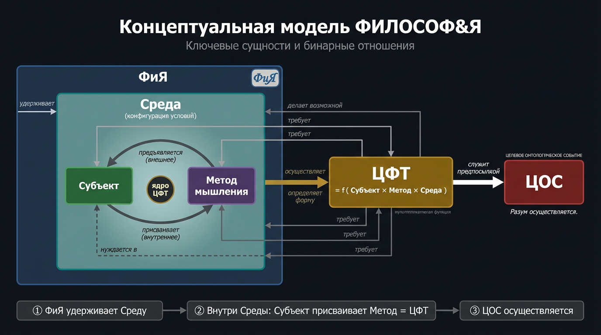
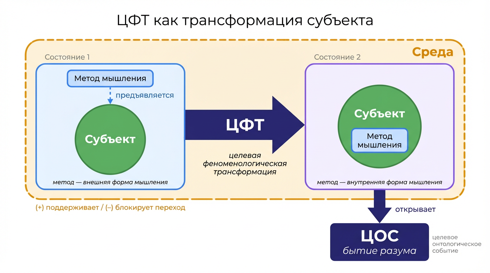

## Назначение и границы документа

Этот документ задаёт целевую концептуальную и операционную модель образовательного ядра школы «ФИЛОСОФ&Я».

Документ описывает:
- онтологическое основание школы;
- целевую феноменологическую трансформацию (ЦФТ) как центральный результат образовательного ядра;
- контуры, через которые школа создаёт условия для ЦФТ;
- операционные паспорта контуров;
- интерфейсы между контурами;
- управленческий метаконтур, удерживающий согласованность образовательного ядра.

Документ не описывает:
- полную операционную модель всей школы;
- маркетинг, продажи, финансы, юридические процедуры, кадровую функцию и общий бэк-офис;
- организационную структуру по должностям и подразделениям;
- эволюцию системы и механизмы встраивания новых решений;
- внешнее сопряжение школы, внешние обещания и клиентско-сервисный слой;
- детальные регламенты отдельных программ, курсов и форматов;
- календарно-ресурсное планирование на уровне конкретных запусков.

Граница охвата зафиксирована явно: данный документ описывает не всю школу как хозяйственную систему, а образовательное ядро школы и сопряжённый с ним метаконтур управления. Полная операционная модель школы должна быть описана в отдельном документе более высокого уровня.

Связанные документы:
- `EP.SCHOOL-PROCESSES-V3` - исходный онтологический и процессный каркас;
- `EP.SCHOOL-CFT-OBSERVATION-PROTOCOL` - процедурный протокол наблюдения, фиксации и агрегации признаков ЦФТ;
- `EP.SCHOOL-STRUCT` - структурное устройство школы;
- `EP.SCHOOL-ENV` - описание среды;
- `EP.SCHOOL-TEAM` - ролевой и командный состав.

## 1. Онтологический уровень описания
### Онтологическое основание ФиЯ

Согласно разумной/спекулятивной философии по истине имеет значение единство мышления и бытия. Бытийствующая всеобщая форма этого единства есть разум. Разум осуществляется в процессе разумного мыслящего познания выполняемого субъектом познания относительно разумного предмета познания. Осуществление этого мы, в «ФИЛОСОФ&Я», назовем целевым онтологическим событием (ЦОС).

Поскольку способность осуществлять разумное познание не дано субъекту изначально, а должно приобретаться, то субъекту необходимо проходить специальный путь становления разумом. Его мы назовем: целевая феноменологическая трансформация (ЦФТ).

ЦФТ субъекта требует вполне определённых условий, поэтому возникает  необходимость в специальной среде. Такой средой и является ФиЯ.

Необходимо имеем три взаимосвязанных шага:
1) ФиЯ конструирует условия для ЦФТ субъекта
2) ЦФТ субъекта служит предпосылкой для осуществления ЦОС в субъекте и субъектом.
3) ЦОС осуществляется. Истина радуется :)

Все метрики процессов в ФиЯ как образовательной системы условий, в конечном счёте, направлены на улучшение условий для осуществления ЦФТ субъекта.

### Целевая феноменологическая трансформация (ЦФТ)

ЦФТ - это процесс качественного преобразования мышления субъекта.

#### Для ЦФТ существенны две ступени:

1. Переход от произвольной непосредственности мышления к мышлению, опосредствованному внешне необходимой формой. Транформация от обыденного сознания к рассудку.
2. Переход от мышления, опосредствованного внешней формой, к мышлению, осуществляющему внутреннюю необходимость понятия. Трансформация от рассудка в разум.

#### ЦФТ имеет три неустранимых элемента:

1. **Субъект** — тот, в ком происходит трансформация и кто единственный может её произвести. Субъект является одновременно агентом и материалом изменения. Никакое внешнее усилие не заменяет его усилия.

2. **Метод** — конкретная форма мышления, которую субъект должен присвоить. Метод исторически вырабатывается и вначале внешен субъекту: его можно показать и передать, но субъект должен сам перевести его из внешней формы во внутреннюю через собственную работу мышления.

3. **Среда** — совокупность условий, при которых трансформация субъекта становится возможной и удерживается достаточно долго. Среда не производит трансформацию в субъекте, но создаёт или блокирует процессы ведущие к трансформации.

#### ЦФТ - мультипликативная функция:

> ЦФТ = f(Метод × Субъект × Среда)

Функция мультипликативная, не аддитивная. Если хотя бы один множитель равен нулю — ЦФТ не происходит. Качественный метод не компенсирует отсутствие усилия субъекта и негодные условия среды. Усилие не компенсирует отсутствие метода и условий среды. Условия среды не компенсируют отсутствие метода и усилий субъекта.

## 2. Концептуальный уровень описания.

На уровне концепта описываются базовые сущности ЦФТ. Здесь фиксируется, из чего состоит предметная модель как системы условий ЦФТ, до перехода к контурам, их топологии и операционным паспортам.

### Концептуальное описание Ключевых сущностей ЦФТ

Ключевой процесс и результат ЦФТ, который должен произойти через создание ФиЯ условий встречи субъекта и метода, - это перевод субъектом метода из внешней формы во внутреннюю.

В концептуальной модели ЦФТ `ФиЯ` понимается не как учебный процесс, организация или отдельная среда, а как особая система условий, удерживающая саму возможность трансформации. Она существует через множество локальных сред и отвечает за то, чтобы встреча субъекта с методом вообще могла состояться и продолжаться достаточно долго. `Среда` при этом является не всей системой целиком, а конкретной конфигурацией пространственных, временных и организационных условий, которая либо открывает возможность ЦФТ, либо блокирует её.

`Субъект` является единственным носителем и производителем собственной трансформации: никакое внешнее действие не может заменить его усилия. `Метод мышления` задаёт определённую форму этой трансформации: ЦФТ не является произвольным изменением, а направляется тем методом, который субъекту предъявлен сначала как внешняя форма. Поэтому ЦФТ конститутивно требует трёх неустранимых элементов одновременно: субъекта, метода мышления и среды. Если отсутствует хотя бы один из них, трансформация не может состояться.

Динамика ЦФТ разворачивается как процесс присвоения метода. **Сначала метод предъявляется субъекту во внешней форме; затем в соответствующей среде становится возможной реальная встреча субъекта с этим методом как с предметом собственной работы. После этого субъект может присвоить метод, то есть перевести его из внешней формы во внутреннюю форму собственного мышления**. Именно это присвоение метода составляет ядро ЦФТ, а сама ЦФТ, в свою очередь, служит предпосылкой для осуществления ЦОС.

#### Таблица Ключевых сущностей ЦФТ

| Сущность | Род сущности | Определение | Инвариант | Подчиненные холоны | Главный вопрос | Не путать с |
|----------|--------------|-------------|-----------|--------------------|----------------|-------------|
| `ФиЯ` | Система условий | Специально устроенная система, создающая и удерживающая условия возможности ЦФТ субъекта | Не производит ЦФТ напрямую, а удерживает возможность её осуществления | образовательный замысел; граница школы как особой системы; набор удерживаемых условий; множество локальных сред | Какие условия должны существовать, чтобы ЦФТ была возможна? | `Среда`, `учебный процесс`, организация |
| `Субъект` | Агент трансформации | Агент, в котором происходит ЦФТ и который единственный может осуществить присвоение метода | Ни одно внешнее действие не заменяет собственного усилия субъекта | внимание; усилие; способность восприятия метода; внутренняя переработка; удержание новой формы мышления | Кто осуществляет последний шаг трансформации? | объект воздействия, элемент системы условий, исполнитель программы |
| `Метод мышления` | Форма мышления | Отчуждаемая, передаваемая и присваиваемая форма мышления, которую субъект должен перевести из внешней формы во внутреннюю | Пока метод не стал внутренней формой мышления субъекта, он не присвоен | различения; мыслительные операции; критерии корректности; границы применимости; внешняя форма; внутренняя форма | Что именно субъект должен сделать своей внутренней формой? | описание метода, инструкция, навык, методика |
| `Среда` | Конфигурация условий | Локальная конфигурация условий, в которой становится возможной встреча субъекта с методом и удержание работы его присвоения | Среда может открывать или блокировать возможность ЦФТ, но не совершает её вместо субъекта | пространственные условия; временные условия; ритм; форма взаимодействия; материал работы; обратная связь; длительность удержания | В какой конфигурации условий присвоение становится возможным? | `ФиЯ`, организация, программа, процесс |

#### Строгая таблица бинарных отношений Ключевых сущностей

| Откуда | Отношение | К чему | Смысл отношения |
|--------|-----------|--------|-----------------|
| `ФиЯ` | удерживает | `Среду` | ФиЯ существует как система условий через множество локальных сред, в которых становится возможной ЦФТ |
| `Среда` | делает возможной | `ЦФТ` | Среда открывает или закрывает возможность ЦФТ, но не осуществляет её вместо субъекта |
| `Субъект` | осуществляет | `ЦФТ` | ЦФТ совершается только самим субъектом |
| `Метод мышления` | определяет форму | `ЦФТ` | ЦФТ не является произвольным изменением, а получает свою определённость через присваиваемый метод |
| `Метод мышления` | предъявляется | `Субъекту` | Метод первоначально существует для субъекта как внешняя форма мышления |
| `Субъект` | присваивает | `Метод мышления` | Метод должен стать внутренней формой мышления субъекта |
| `ЦФТ` | служит предпосылкой | `ЦОС` | ЦФТ подготавливает субъекта к осуществлению целевого онтологического события |
| `Субъект` | нуждается в | `Среде` | Без среды, удерживающей возможность работы, субъект не может устойчиво пройти ЦФТ |
| `Субъект` | нуждается в | `Методе мышления` | Без метода трансформация не может быть направленной и определённой |
| `ЦФТ` | требует | `Субъекта` | Без субъекта ЦФТ невозможна |
| `ЦФТ` | требует | `Метода мышления` | Без метода ЦФТ невозможна |
| `ЦФТ` | требует | `Среды` | Без среды ЦФТ невозможна |

#### Конститутивные отношения

| Откуда | Отношение | К чему | Смысл отношения |
|--------|-----------|--------|-----------------|
| `ФиЯ` | удерживает | `Среду` | ФиЯ существует как система условий через множество локальных сред, в которых становится возможной ЦФТ |
| `Среда` | делает возможной | `ЦФТ` | Среда открывает или закрывает возможность ЦФТ, но не осуществляет её вместо субъекта |
| `Субъект` | осуществляет | `ЦФТ` | ЦФТ совершается только самим субъектом |
| `Метод мышления` | определяет форму | `ЦФТ` | ЦФТ не является произвольным изменением, а получает свою определённость через присваиваемый метод |
| `ЦФТ` | служит предпосылкой | `ЦОС` | ЦФТ подготавливает субъекта к осуществлению целевого онтологического события |
| `ЦФТ` | требует | `Субъекта` | Без субъекта ЦФТ невозможна |
| `ЦФТ` | требует | `Метода мышления` | Без метода ЦФТ невозможна |
| `ЦФТ` | требует | `Среды` | Без среды ЦФТ невозможна |

#### Динамика присвоения метода

| Откуда | Отношение | К чему | Смысл отношения |
|--------|-----------|--------|-----------------|
| `Метод мышления` | предъявляется | `Субъекту` | Метод первоначально существует для субъекта как внешняя форма мышления |
| `Субъект` | встречается с | `Методом мышления` | Присвоение начинается там, где субъект реально сталкивается с методом как с предметом собственной работы |
| `Среда` | делает возможной встречу | `Субъекта` с `Методом мышления` | Среда собирает условия, при которых встреча субъекта с методом может состояться и удерживаться |
| `Субъект` | присваивает | `Метод мышления` | Метод должен стать внутренней формой мышления субъекта |
| `Среда` | поддерживает или блокирует | `Присвоение метода` | Среда влияет на возможность и устойчивость перехода метода из внешней формы во внутреннюю |
| `Присвоение метода` | составляет ядро | `ЦФТ` | Центральное содержание ЦФТ состоит в превращении внешнего метода во внутреннюю форму мышления субъекта |

## 3. Уровень Архитектуры. Контуры ФиЯ.

Из концептуальной модели ЦФТ следует, что `ФиЯ` существует как среда, в которой для субъекта создаются условия для присваивания метода, перевода его из внешней формы во внутреннюю.

Отсюда следует, что минимальной архитектурной единицей образовательного ядра является не занятие, не программа и не подразделение, а **локальная среда присвоения метода** (ЛСПМ).

Тем самым `ФиЯ` на уровне архитектуры может быть определена так: 

> `ФиЯ` = система порождения, связывания и удержания локальных сред ЦФТ субъекта.

Тогда Архитектурная задача `ФиЯ` состоит в том, чтобы:
- обеспечивать формулирование образца метода мышления (`ОММ`);
- порождать условия присваивания субъектом ОММ;
- удерживать согласованность всей системы локальных среда.

Субъект не входит в архитектуру `ФиЯ` как управляемый элемент.

Эта логика уже проявлена в опыте школы через разные типы локальных сред: `Основной курс НИФ`, `Модульный курс НИФ`, `Эпохальный курс НИФ`, игра `АнтиСофист`, игра `Револьвер Реальности`. На уровне архитектуры они важны как разные типы локальных сред, которые могут быть сознательно спроектированы и связаны в единую систему условий ЦФТ.

### 3.1. Общая архитектурная модель ФиЯ. Контуры.

Контур — элемент структуры ФиЯ для поддержания условий, в которых у субъекта становится возможным ЦФТ. Контуры определены **онтологией**, а не организацией.

Центральным контуром здесь является не "учебный процесс", а `ЛСПМ`, поскольку именно локальная среда является минимальной архитектурной формой существования `ФиЯ`. Остальные контуры удерживают соответственно метод как внешнюю форму, вход субъекта, связность сред и согласованность системы в целом.

| Роль в архитектуре | Контур | Назначение | Что удерживает | Главный вопрос контура |
|--------------------|--------|------------|----------------|------------------------|
| Центральный | `ЛСПМ` | Локальные среды присвоения метода | Конкретные локальные среды, в которых становится возможной встреча субъекта с методом и удержание работы присвоения | В какой локальной среде встреча субъекта с методом действительно становится возможной и удерживается? |
| Производящий | `ОВФМ` | Объективация внешней формы метода | Метод мышления как явную, отчуждаемую, проверяемую и предъявимую внешнюю форму | В какой форме метод должен быть дан субъекту, чтобы его можно было реально присваивать? |
| Обеспечивающий | `ВС` | Вход субъекта | Архитектурные условия входа субъекта в работу присвоения метода | Как должна быть устроена среда, чтобы субъект мог реально войти в работу, а не остаться внешним наблюдателем? |
| Связывающий | `СС` | Связность сред | Связь локальных сред в непрерывную и достаточно длительную траекторию ЦФТ | Как отдельные локальные среды должны быть связаны между собой, чтобы присвоение метода не распадалось? |
| Метасистемный | `МС` | Метасогласование | Целостность, согласованность и перенастройку всей системы локальных сред относительно цели ЦФТ | Сохраняет ли вся система локальных сред согласованность с задачей ЦФТ? |

#### ЛСПМ
**ЛСПМ, локальная среда присвоения метода** — это важнейшая архитектурная единица ФиЯ, собранная как целое ради одной функции — сделать возможной реальную встречу субъекта с методом и удержать работу его присвоения.

ЛСПМ, следовательно, должна пониматься не как простая совокупность условий, а как имеющее собственное внутреннее устройство локальное целое. 

Прежде всего, ЛСПМ включает пространственную и временную форму среды. Пространственная конфигурация удерживает место, дистанции, композицию присутствия и возможность совместной работы. Временная форма удерживает длительность, повторяемость и протяжённость существования данной среды.

Далее, ЛСПМ должна иметь собственный ритм. Ритм удерживает внутренний рисунок движения работы: чередование напряжения, пауз, возвратов и рубежей.

Необходимой частью ЛСПМ является и форма взаимодействия. Она удерживает способ встречи субъекта с методом внутри среды: режим предъявления, попытки, ответа, разбора и продолжения работы. Форма взаимодействия не совпадает с самим методом, но задаёт тот способ работы, в котором метод становится для субъекта не только предметом объяснения, но и предметом исполнения.

ЛСПМ также включает предметный материал, через который субъект реально работает с методом. Это могут быть тексты, задачи, упражнения, схемы, кейсы или игровые объекты. Предметный материал не тождествен внешней форме метода: он не показывает метод как таковой, а даёт материал, на котором метод может быть реально разыгран и присвоен.

Неустранимой частью ЛСПМ является обратная связь. Она удерживает возможность различать ход собственной работы внутри среды: видеть продвижение, распознавать выпадение, отличать удержание метода от его утраты. Без этого среда перестаёт быть средой присвоения и становится лишь местом выполнения действий.

Наконец, ЛСПМ должна иметь рамку участия. Рамка удерживает границу данной локальной среды как отдельного рабочего целого: условия входа, выхода, участия и пределы этой среды относительно других. Она не совпадает ни с межсредовой связностью, ни с общей организацией школы, а удерживает определённость именно данной локальной среды.

Тем самым ЛСПМ не производит ЦФТ вместо субъекта и не равна ни занятию, ни программе, ни организационному формату. Её инвариант состоит в том, что пространство, время, ритм, форма взаимодействия, предметный материал, средовая обратная связь и рамка участия должны быть собраны в одну конфигурацию условий, внутри которой субъект может реально начать и продолжать работу с методом.

Если хотя бы одна из этих частей отсутствует или рассогласована, локальная среда может внешне сохраняться как событие или формат, но перестаёт быть ЛСПМ в строгом смысле: она больше не удерживает условия присвоения метода.

### 3.2. Архитектура ЛСПМ как системного holon'а

Чтобы `ЛСПМ` могла быть не только описана, но и сознательно спроектирована, её необходимо рассматривать как собственный holon внутри `ФиЯ`: локальное целое, имеющее границу, инвариант, внутреннюю структуру, операционный цикл и интерфейсы с другими контурами.

В этом качестве `ЛСПМ` должна строиться по следующим принципам системного подхода:

1. **Принцип целостности.** `ЛСПМ` оценивается не по наличию отдельных сильных элементов, а по тому, собраны ли её части в одно работоспособное целое.
2. **Принцип функциональной определённости.** Каждая внутренняя часть `ЛСПМ` оправдана только постольку, поскольку удерживает возможность присвоения метода.
3. **Принцип границы.** `ЛСПМ` управляет условиями среды, но не управляет субъектом как носителем собственной трансформации.
4. **Принцип иерархичности.** `ЛСПМ` сама является частью большей системы локальных сред `ФиЯ` и одновременно состоит из собственных подчинённых holon'ов.
5. **Принцип интерфейсности.** `ЛСПМ` получает метод, режим входа и требования к связности извне и не подменяет собой соседние контуры.
6. **Принцип ритмичности.** Внутри `ЛСПМ` должен существовать собственный рисунок напряжения, пауз, возвратов и рубежей, без которого работа присвоения распадается.
7. **Принцип наблюдаемости.** Работоспособность `ЛСПМ` различается только через подтверждающие материалы, сигналы выпадения и устойчивость самой среды, а не через декларации.
8. **Принцип воспроизводимости.** `ЛСПМ` должна быть повторно собираема в собственных границах без утраты инварианта.
9. **Принцип некомпенсируемости.** Сильный предметный материал не компенсирует отсутствие обратной связи; хороший ритм не компенсирует разрушенную форму взаимодействия.

Из этого следует, что `ЛСПМ` должна пониматься как трёхслойная архитектура:

| Архитектурный слой | Внутренние части | Что удерживает | Главный вопрос слоя |
|--------------------|------------------|----------------|---------------------|
| Слой удержания условий | Пространственная конфигурация, временная форма, ритм | Где, когда и в какой плотности существует работа присвоения метода | Может ли работа с методом вообще удерживаться как событие и процесс? |
| Слой разворачивания метода | Форма взаимодействия, предметный материал, средовая обратная связь | Как субъект встречается с методом, исполняет его и различает собственный ход | Становится ли метод внутри среды предметом реального исполнения? |
| Слой границы среды | Рамка участия | Определённость данной локальной среды как отдельного рабочего целого | Где границы этой среды, кто и на каких условиях в неё входит и выходит? |

Тем самым минимальной единицей проектирования `ЛСПМ` является не лекция, не отдельное упражнение и не организационный слот, а воспроизводимый цикл работы присвоения метода:

> предъявление внешней формы метода -> попытка исполнения -> разбор хода -> повторное исполнение -> рубеж различения

Именно этот цикл образует минимальную рабочую клетку `ЛСПМ`. Если среда допускает только слушание, обсуждение или выполнение действия без различения мыслительного хода, она не достигает уровня архитектуры присвоения метода.

#### 3.2.1. Граница и инвариант `ЛСПМ`

Архитектурная граница `ЛСПМ` проходит там, где заканчивается локальная конфигурация условий одной среды и начинаются:
- либо внешняя форма метода как продукт `ОВФМ`,
- либо архитектура входа субъекта как зона `ВС`,
- либо связность нескольких сред как зона `СС`,
- либо диагностика и перенастройка системы как зона `МС`.

Следовательно, в `ЛСПМ` входят:
- локальная конфигурация пространства, времени и ритма;
- форма взаимодействия субъекта с методом;
- предметный материал работы;
- средовая обратная связь;
- рамка участия и граница данной среды;
- подтверждающие материалы, возникающие из работы внутри среды;
- сигналы о разрывах, фиксируемые по состоянию среды.

В `ЛСПМ` не входят:
- изменение самого метода;
- определение общешкольной траектории переходов между средами;
- производство сценариев входа как самостоятельного архитектурного класса;
- постановка окончательного заключения о `ЦФТ` субъекта;
- метадиагностика рассогласований всей системы.

Инвариант `ЛСПМ` может быть сформулирован строго:

> `ЛСПМ` существует тогда и только тогда, когда пространство, время, ритм, форма взаимодействия, предметный материал, средовая обратная связь и рамка участия собраны в локально воспроизводимую конфигурацию, внутри которой субъект может реально войти в работу с методом, удержать её и оставить различимые подтверждающие материалы этого хода.

#### 3.2.2. Интерфейсы `ЛСПМ` с соседними контурами

| Смежный контур | Что `ЛСПМ` получает | Что `ЛСПМ` передаёт | Что `ЛСПМ` не вправе делать |
|----------------|---------------------|---------------------|-----------------------------|
| `ОВФМ` | Внешнюю форму метода, критерии корректности, границы применимости | Сигналы об искажениях предъявленного метода, подтверждающие материалы о том, как метод реально встречается внутри среды | Пересобирать метод, менять критерии корректности и границы применимости |
| `ВС` | Порог входа, сценарии первичного включения, механизмы повторного входа | Сигналы о не-входе, выпадении и характере стартового сопротивления внутри конкретной среды | Подменять собой контур входа и произвольно менять архитектуру включения субъекта |
| `СС` | Требования к преемственности, условия перехода, ожидания к профилю прохождения среды | Профиль прохождения среды, сигналы о том, что может быть перенесено в следующую среду, сведения о незавершённой работе | Самостоятельно определять маршрут, ритм и порядок перехода между средами |
| `МС` | Решения о перенастройке, диагностические запросы, нормы наблюдаемости | Подтверждающие материалы, сигналы о разрывах, профиль состояния локальной среды | Ставить метадиагноз всей системе и принимать решения за другие контуры |

Эти интерфейсы необходимы потому, что в противном случае `ЛСПМ` либо сужается до формата проведения занятий, либо расширяется до неразличимого ядра, которое одновременно и учит, и проектирует метод, и управляет траекторией, и диагностирует систему. Такое расширение разрушает архитектурную различимость контуров.

#### 3.2.3. Архитектурный паспорт `ЛСПМ`

Ниже дан концептуальный архитектурный паспорт `ЛСПМ`, который фиксирует её как самостоятельный holon до уровня операционной детализации:

| Поле | Содержание |
|------|------------|
| Роль в надсистеме | Центральный контур образовательного ядра, локально удерживающий условия присвоения метода |
| Граница и инвариант | Внутри `ЛСПМ` удерживается только локальная конфигурация условий одной среды; инвариант состоит в воспроизводимой сборке семи неустранимых частей, делающей возможной реальную работу субъекта с методом |
| Внутренняя структура | Слой удержания условий; слой разворачивания метода; слой границы среды |
| Конфигурация элементов | Пространство, время и ритм должны быть согласованы с формой взаимодействия, предметным материалом, обратной связью и рамкой участия; выпадение любого элемента разрушает целое |
| Жизненный цикл ключевого элемента | Проектирование среды -> сборка конфигурации -> запуск -> удержание по рубежам -> локальная коррекция -> завершение или передача в следующую среду |
| Операционный цикл | Предъявление -> попытка -> разбор -> повторное исполнение -> рубеж различения |
| Интерфейсы и обмен | Получает от `ОВФМ`, `ВС`, `СС`, `МС` необходимые входы; возвращает подтверждающие материалы, сигналы и профиль прохождения среды в пределах собственной компетенции |
| Наблюдаемость | Различаются вход в работу, удержание усилия, наличие подтверждающих материалов, частота выпадения, устойчивость конфигурации среды и воспроизводимость её границ |
| Единица изменения | Конфигурация одной локальной среды или один её внутренний holon при сохранении общего инварианта |

Для домена обучения методу из этого паспорта следуют пять обязательных требований к любой `ЛСПМ`:

1. Метод должен быть центром среды, а не темой разговора внутри неё.
2. Предметный материал должен требовать применения метода, а не мнения о методе.
3. Обратная связь должна различать правильность мыслительного хода, а не только внешний результат.
4. Ритм должен включать возвраты и повторные исполнения, иначе метод остаётся внешней формой.
5. Рамка участия должна удерживать обязательность усилия, не подменяя его административным принуждением.

### 3.3. Собственные подчинённые holon'ы контуров

Каждый контур образовательного ядра должен рассматриваться как собственный holon, имеющий внутреннее устройство. Подчинённый holon здесь - не должность, не роль и не шаг процесса, а внутренняя часть контура, необходимая для выполнения его архитектурной функции.

Ниже таблица показывает, из каких внутренних частей должен состоять каждый контур `ФиЯ`, если выводить его устройство из собственного инварианта. Для этого внутри каждого контура различены собственные внутренние зоны, а уже внутри них перечислены подчинённые holon'ы. Тем самым таблица описывает не процессные шаги и не роли исполнителей, а внутреннюю архитектуру контуров: устройство среды, устройство метода, устройство входа, устройство траектории и устройство метасогласования.

#### Таблица подчинённых holon'ов контуров

| Контур | Внутренняя зона | Подчинённый holon | Роль внутри контура | Что удерживает | Не путать с |
|--------|-----------------|-------------------|---------------------|----------------|-------------|
| `ЛСПМ` | Устройство среды | holon пространственной конфигурации среды | Удерживает пространственное устройство локальной среды как условие совместной работы | Место, дистанции, композицию пространства, возможность совместного присутствия | Общей организационной инфраструктурой школы |
| `ЛСПМ` | Устройство среды | holon временной формы среды | Удерживает временную форму существования локальной среды как протяжённость работы | Длительность, повторяемость, продолжительность и временную собранность среды | Общим расписанием школы |
| `ЛСПМ` | Устройство среды | holon ритма среды | Удерживает внутренний рисунок движения работы внутри локальной среды | Чередование напряжения, пауз, возвратов, рубежей и плотность внутреннего хода | Ритмом переходов между средами в `СС` |
| `ЛСПМ` | Устройство среды | holon формы взаимодействия | Удерживает способ встречи субъекта с методом внутри среды | Тип коммуникации, форму совместной и индивидуальной работы, режим предъявления и ответа | Самим методом мышления |
| `ЛСПМ` | Устройство среды | holon предметного материала | Удерживает материал, через который субъект реально работает с методом | Тексты, задачи, упражнения, схемы, игровые объекты, кейсы | Внешней формой метода в `ОВФМ` |
| `ЛСПМ` | Устройство среды | holon средовой обратной связи | Удерживает возможность субъекту распознавать ход собственной работы внутри среды | Формы отклика, различение верного и ложного хода, сигналы удержания или выпадения | Критериями корректности метода в `ОВФМ` |
| `ЛСПМ` | Рамка среды | holon рамки локальной среды | Удерживает определённость локальной среды как отдельного рабочего целого | Условия входа, выхода, рамку участия и границу данной среды относительно других | Маршрутизацией между средами в `СС` |
| `ОВФМ` | Ядро метода | holon различений метода | Удерживает исходные различения, без которых метод не существует как определённая форма мышления | Базовые различения, на которых строится метод | Тематикой, сюжетом или темой курса |
| `ОВФМ` | Ядро метода | holon операций метода | Удерживает те мыслительные операции, которые составляют действие метода | Последовательности и типы операций, составляющих метод | Навыком исполнителя или стилем ведения |
| `ОВФМ` | Объективация метода | holon внешней формы метода | Делает метод доступным как внешнюю, отчуждаемую и предъявимую форму | Формулировки, схемы, образцы, демонстрации, задания | Внутренним присвоением метода субъектом |
| `ОВФМ` | Объективация метода | holon критериев корректности | Удерживает возможность распознавать, действительно ли предъявлен и выполняется именно данный метод | Критерии правильного и неправильного хода, признаки искажений метода | Обратной связью внутри конкретной среды |
| `ОВФМ` | Объективация метода | holon границ применимости метода | Удерживает определённость метода через его область действия и пределы | Где метод работает, где перестаёт работать, с чем его нельзя смешивать | Локальной настройкой среды или формата |
| `ВС` | Доступ к входу | holon порога входа | Удерживает минимальные условия, при которых субъект может перейти от внешнего присутствия к началу работы | Порог сложности, понятности, включаемости и доступности первого действия | Отбором, селекцией или административным допуском |
| `ВС` | Запуск входа | holon первичного включения | Переводит субъекта из позиции наблюдения в позицию действующей мысли | Первый реальный шаг работы с методом | Полным циклом работы внутри среды |
| `ВС` | Удержание входа | holon удержания входящего усилия | Не даёт субъекту выпадать при первом сопротивлении и инерции | Условия продолжения усилия, концентрации и возвращения к задаче на начальном участке входа | Общим сопровождением всей траектории субъекта |
| `ВС` | Возврат ко входу | holon повторного включения | Делает возможным повторный вход после выпадения без разрушения пути | Механизмы повторного включения в работу | Межсредовым переходом как таковым |
| `СС` | Связка сред | holon перехода между средами | Связывает одну локальную среду с другой без потери предмета работы | Условия перехода, передачу предмета и незавершённой работы | Входом в отдельную среду в `ВС` |
| `СС` | Связка сред | holon предметной непрерывности | Удерживает тождество предмета работы при переходе между средами | Перенос именно той работы с методом, которая уже была начата, а не произвольного результата вообще | Общей преемственностью программы без предметной конкретности |
| `СС` | Траектория сред | holon ритмической связности | Удерживает правильную частоту и плотность переходов между средами | Интервалы, плотность и своевременность смены сред | Внутренним ритмом локальной среды |
| `СС` | Траектория сред | holon маршрутизации траектории | Связывает разные типы локальных сред в единую траекторию ЦФТ | Осмысленную последовательность сред и их соотнесённость с задачей присвоения метода | Простым календарным порядком занятий |
| `МС` | Норма системы | holon карты инвариантов контуров | Удерживает различимость контуров, их инвариантов и допустимых границ вмешательства | Карту норм системы, относительно которой возможна диагностика рассогласований | Набором частных кейсов или текущих договорённостей |
| `МС` | Наблюдение системы | holon архитектурного наблюдения | Удерживает видимость состояния всей системы локальных сред и контуров | Наблюдаемость контуров, различимость их состояния и согласованности | Суждением о ЦФТ отдельного субъекта |
| `МС` | Управление рассогласованием | holon диагностики рассогласований | Выявляет, в каком именно контуре нарушены условия ЦФТ и где находится причина разрыва | Типы рассогласований, места разрыва, дефициты условий | Исправлением дефекта внутри рабочего контура |
| `МС` | Управление рассогласованием | holon маршрутизации вмешательства | Передаёт управленческое решение в нужный контур и удерживает адресность вмешательства | Контур-владелец, маршрут вмешательства, связку причины и решения | Прямым выполнением работы за другой контур |
| `МС` | Память системы | holon архитектурной памяти | Удерживает накопленное знание о рабочих и нерабочих конфигурациях системы | Память о типах сред, сочетаниях контуров и повторяющихся дефектах | Историей отдельных кейсов без обобщения |

## 4. Операционная модель

### 4.1. Операционные паспорта контуров

#### 4.1.1. `ОВФМ`

| Поле | Содержание |
|------|------------|
| Владелец | Владелец контура объективации внешней формы метода |
| Триггер | Появление нового метода, сигнал о неясности его предъявления, спор о корректности внешней формы, запрос из `ЛСПМ` или `МС` |
| Ритм | По мере появления нового метода или дефекта его предъявления; обязательный обзор портфеля внешних форм на регулярном рубеже |
| Артефакты | Вход: действующие формы метода, сигналы из локальных сред, материалы практики. Выход: внешняя форма метода, критерии корректности, границы применимости, решение о пересмотре |
| Критерии приёмки | Метод явлен как отчуждаемая, проверяемая и различимая внешняя форма; критерии корректности и границы применимости заданы явно |
| Эскалация | Повторяющееся искажение метода в локальных средах, спор о корректности формы, невозможность сделать метод достаточно явным для присвоения |
| Права принятия решений | Утверждать, пересматривать и снимать внешние формы метода; не вправе самостоятельно менять связность сред или режим входа субъекта |

#### 4.1.2. `ЛСПМ`

| Поле | Содержание |
|------|------------|
| Владелец | Владелец контура локальных сред присвоения метода |
| Триггер | Запуск новой локальной среды, рабочий рубеж, сигнал о выпадении субъекта из работы, решение `МС`, изменение типа среды |
| Ритм | По ритму конкретной локальной среды; обязательный обзор состояния среды на фиксированных рубежах её удержания |
| Артефакты | Вход: внешняя форма метода, критерии корректности, границы применимости, сценарии входа, требования к преемственности, конфигурация пространства, времени, взаимодействия и материала. Выход: работы субъекта, подтверждающие материалы, сигналы о разрывах, сигналы об искажениях метода, профиль прохождения среды |
| Критерии приёмки | Встреча субъекта с методом реально происходит, работа присвоения удерживается, подтверждающие материалы собираются, среда воспроизводима в собственных границах |
| Эскалация | Массовое выпадение субъектов, невозможность удерживать встречу с методом, отсутствие подтверждающих материалов, повторяющийся распад локальной среды |
| Права принятия решений | Настраивать и удерживать локальную среду в её границах, фиксировать подтверждающие материалы и сигналы; не вправе менять сам метод, архитектуру входа, логику межсредовой связности или ставить метадиагноз системы |

#### 4.1.3. `ВС`

| Поле | Содержание |
|------|------------|
| Владелец | Владелец контура входа субъекта |
| Триггер | Пороговый сигнал о не-входе субъекта, новый тип локальной среды, повторяющееся выпадение на старте, решение `МС` |
| Ритм | На каждом входе в локальную среду; обязательный пересмотр режимов входа на рубежах смены формата |
| Артефакты | Вход: внешняя форма метода, профиль локальной среды, сигналы из `ЛСПМ`. Выход: сценарии входа, условия первичного включения, механизмы возврата, решение о перенастройке |
| Критерии приёмки | Субъект переводится из позиции внешнего присутствия в позицию реальной работы; первый шаг присвоения становится возможным и воспроизводимым |
| Эскалация | Систематическое невключение субъектов, высокий порог входа, невозможность вернуть субъекта в работу после выпадения |
| Права принятия решений | Проектировать и изменять режимы входа и возврата; не вправе менять ядро метода или архитектуру связности сред |

#### 4.1.4. `СС`

| Поле | Содержание |
|------|------------|
| Владелец | Владелец контура связности сред |
| Триггер | Появление новой локальной среды, разрыв между средами, потеря преемственности, решение `МС` |
| Ритм | По циклам маршрутизации локальных сред; обязательный пересмотр траектории на рубежах перехода между средами |
| Артефакты | Вход: карта локальных сред, сигналы из `ЛСПМ`, требования к длительности пути. Выход: маршрут переходов, схема преемственности, решения о ритме смены сред |
| Критерии приёмки | Локальные среды связаны в непрерывную траекторию, переходы не обнуляют работу присвоения, ритм поддерживает удержание метода |
| Эскалация | Разрыв траектории, случайный набор сред вместо пути, потеря результатов при переходе, несоразмерный ритм смены сред |
| Права принятия решений | Определять порядок, ритм и преемственность локальных сред; не вправе менять внутреннюю конфигурацию отдельной среды или содержание метода |

#### 4.1.5. `МС`

| Поле | Содержание |
|------|------------|
| Владелец | Владелец метасистемного контура согласования |
| Триггер | Пороговый сигнал из любого контура, межконтурный конфликт, повторяющийся разрыв по ЦФТ, потеря согласованности архитектуры |
| Ритм | Непрерывный приём сигналов; регулярный цикл диагностики, маршрутизации решений и контроля перенастройки |
| Артефакты | Вход: сигналы контуров, подтверждающие материалы из `ЛСПМ`, данные наблюдаемости. Выход: диагностический кейс, решение о перенастройке, маршрут вмешательства, запись в архитектурную память |
| Критерии приёмки | Для каждого разрыва определены локализация, контур-владелец, тип вмешательства, срок проверки и критерий закрытия |
| Эскалация | Невозможность локализовать причину, устойчивый межконтурный конфликт, повторное открытие закрытого кейса, накопление неразрешённых рассогласований |
| Права принятия решений | Принимать решения о метасогласовании и маршрутизировать вмешательства; не вправе подменять рабочие операции других контуров их собственным содержанием |

### 4.2. Наблюдаемость и метрики

| Контур | Что наблюдается | Основные метрики | Источник данных | Частота пересмотра | Порог патологии |
|--------|-----------------|------------------|-----------------|----------------|-----------------|
| `ОВФМ` | Ясность, корректность и различимость внешней формы метода | Доля методов с полной внешней формой; число возвратов на пересборку; повторяемость искажений метода в локальных средах | Реестр внешних форм метода, сигналы из `ЛСПМ` и `МС` | На рубежах пересмотра портфеля методов | Метод системно не распознаётся или искажается в средах |
| `ЛСПМ` | Работоспособность локальных сред и подтверждаемость встречи субъекта с методом | Доля рабочих локальных сред; удержание субъектов в среде; полнота подтверждающих материалов; частота распада среды | Журналы локальных сред, работы субъектов, подтверждающие материалы | По ритму каждой среды и на рубежах её удержания | Среда не удерживает работу, не собирает подтверждения или системно распадается |
| `ВС` | Качество входа субъекта в работу присвоения метода | Доля успешных входов; частота выпадения на старте; число успешных возвратов; среднее время до включения в работу | Сценарии входа, сигналы из `ЛСПМ`, наблюдения по первым рубежам среды | На каждом типе входа и на рубежах смены формата | Субъект массово не входит в работу или не возвращается после выпадения |
| `СС` | Непрерывность и преемственность траектории между средами | Доля переходов без потери работы; число разрывов траектории; плотность ритма; степень накопления результатов между средами | Карта маршрутов, сигналы переходов, данные из `ЛСПМ` | На рубежах перехода и по завершении циклов траектории | Среды превращаются в несвязанный набор или переходы обнуляют присвоение |
| `МС` | Качество метасогласования и перенастройки архитектуры | Время локализации причины; доля решений с закрытием в срок; число повторно открытых кейсов; доля рассогласований без владельца | Реестр кейсов, решения, сигналы контуров, архитектурная память | Регулярный метасистемный цикл | Скопление кейсов без локализации, владельца или критерия закрытия |

### 4.3. Обязательные управленческие правила

1. Подтверждённые материалы о ходе ЦФТ в `МС` поступают только из `ЛСПМ`.
2. Контуры `ОВФМ`, `ВС` и `СС` могут передавать в `МС` только операционные сигналы, но не заключения о ЦФТ субъекта.
3. Ни один контур не должен принимать решение за другой контур в его собственной зоне инварианта.
4. Любой системный спор о принадлежности дефекта разрешается через `МС`.
5. Любое изменение нормы внутри охвата этого документа проходит через явную фиксацию локальной коррекции или управленческого вмешательства; эволюция системы описывается вне данного документа.

## Глоссарий

| Термин | Определение |
|--------|-------------|
| `ЦОС` | Целевое онтологическое событие. Осуществление разумного мышления субъектом |
| `ЦФТ` | Целевая феноменологическая трансформация. Внутренний процесс качественного изменения структуры мышления субъекта |
| `Локальная среда ЦФТ` | Конкретная конфигурация условий, в которой становится возможной встреча субъекта с методом и удержание работы его присвоения |
| `ЛСПМ` | Контур локальных сред присвоения метода. Центральный контур архитектуры образовательного ядра |
| `ОВФМ` | Контур объективации внешней формы метода. Удерживает метод как явную, отчуждаемую и проверяемую внешнюю форму |
| `ВС` | Контур входа субъекта. Удерживает архитектурные условия, при которых субъект может реально войти в работу присвоения метода |
| `СС` | Контур связности сред. Удерживает переходы, ритм и преемственность между локальными средами |
| `МС` | Метасистемный контур согласования. Удерживает целостность архитектуры, диагностику рассогласований и перенастройку системы |
| `Рубеж` | Фиксированная точка пересмотра в программе, на которой пересматривается состояние когорты, контуров или решений |
| `Подтверждающие материалы` | Проверяемый артефакт, на основании которого допускается вывод о наличии или отсутствии наблюдаемого признака |
| `Сигнал` | Структурированное указание на проблему, риск или разрыв, требующее диагностики |
| `Диагностический кейс` | Формализованная управленческая единица, в которой зафиксированы проблема, гипотеза причины, владелец, срок и критерий закрытия |
| `Локальная коррекция` | Исправление дефекта внутри контура без изменения межконтурных интерфейсов и инварианта |
| `Управленческое вмешательство` | Решение `МС`, необходимое для межконтурной координации или устранения повторяющегося сбоя |
| `Контур` | Самостоятельное целое, отвечающее за определённый аспект условий ЦФТ и имеющее собственный инвариант |
| `Holon` | Целое, которое само является частью большего целого и может иметь собственные подчинённые части |
